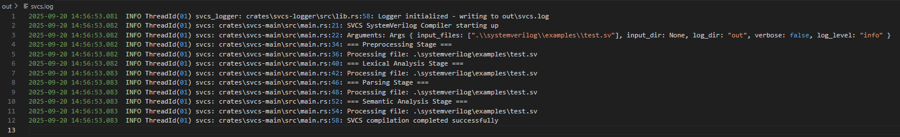

# SVCS – SystemVerilog Compiler and Simulator

**SVCS is a modular, Rust-based compiler and simulator for SystemVerilog source files. It provides a complete end-to-end toolchain, from preprocessing through semantic analysis, with a flexible command-line interface and robust logging.**



## Features

### Modular Architecture

  - Each compilation stage is implemented as its own crate:

  - svcs-preprocessor: Handles \define, include`, and other preprocessing directives

  - svcs-lexer: Performs lexical analysis to generate tokens

  - svcs-parser: Builds an abstract syntax tree (AST) from tokens

  - svcs-analyzer: Conducts semantic checks on the AST

### Command-Line Interface

  - Uses clap to support:

  - Multiple input files: -i file1.sv file2.sv ...

  - Directory processing: --dir src/

  - Custom log directory: --log-dir logs/

  - Log level control: --log-level debug|info|warn|error

### Comprehensive Logging

  - Powered by tracing and tracing-subscriber:

  - Timestamped log files in out/YYYYMMDD_HHMMSS.log

  - Always-current latest.log reflecting the final build output

  - Dual console and file output with thread IDs, file/line info, and configurable formatting

  - Cargo Workspace

  - Shared dependencies and versions are managed centrally:

  - Single Cargo.toml workspace manifest

  - Individual Cargo.toml for each crate with minimal boilerplate

  - Scalable and Testable
  
  - Easy to add new compilation stages, run unit and integration tests for each crate, and extend functionality.

## Quick Start

**Clone the repository** 
```
git clone https://github.com/yourusername/svcs.git

cd svcs

cargo build

# Run SVCS on one or more SystemVerilog files
cargo run --bin svcs -- -i my_design.sv

# Process all .sv files in a directory
cargo run --bin svcs -- --dir src/

# Customize logging
cargo run --bin svcs -- -i test.sv --log-dir build_logs --log-level debug

```

